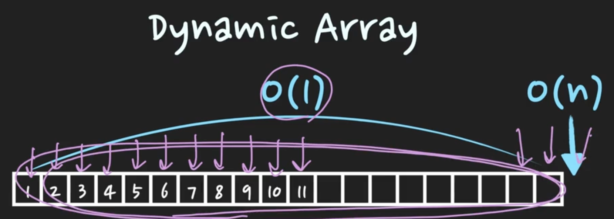

# Array & Linked List
**배열 & 연결리스트**


**이번 챕터에서는 배열(Array)과 연결 리스트(Linked List)에 대해서 알아보도록 하겠습니다.                    추가적으로 이와 관련된 면접 질문들과 우리가 사용하는 JS의 배열은 어떻게 동작하는지에 대해서도 조사해보았습니다.**


# 🤵🏻‍♂️ 배열 ( Array )

## 📌 배열의 특징


💡 **Array**는 data들을 **메모리 공간에서 연속적**으로 저장되며 **미리 할당한 크기**로 저장하는 공간입니다.


![⇒ array[4] = {1,2,3,4};](assets/1_array.png)
⇒ array[4] = {1,2,3,4};

- 위 사진과 같이 배열의 각 index는 특정 메모리 주소값과 그에 따른 값을 가진다.
- 따라서 위의 경우는 한 data가 4byte의 공간을 차지하고 있다는 것 알수있음.
- 각 data의 주소값은 가장 첫번째의 주소값으로 지정된다.
- 배열은 메모리 상에서 연속적으로 저장되어 있는 특성을 가지기 때문에 **index**를 통한 접근에 용이하다.
- 배열의 크기는 처음 생성할 때 정하며 이후에는 **변경할 수 없다**.

**⇒ Array의 특징 :  고정된 저장 공간(fixed size) 과 순차적인 데이터 저장 (order)**

## 📌 배열의 시간복잡도 ( Time Complexity of Array Operations)

- 조회(lookup) : O(1) ⇒ Random Access
- 마지막 index에 추가(append) : O(1)
- 마지막 index에 삭제 : O(1)

**⇒  Array는 연속적인 데이터로 구성되어 있어서, 조회/추가/삭제하려는 데이터의 위치를 이미 알고있다.** 

**따라서, O(1)이 소요된다.**

- 삽입(insert) : O(n)
- 삭제(delete): O(n)
- 탐색(search) : O(n)

**⇒ Array는 연속적인 데이터로 특정 index에 삭제,삽입,탐색하는 경우 O(n) 이 소요된다.**

    **(특정 위치에 삽입하거나 삭제하는 경우 데이터가 밀린만큼 당겨줘야 하기 때문에)**

## 📌 배열의 장단점

### 장점

⇒ 조회(lookup)과 추가(append)에서 빠른 시간복잡도를 보인다.

따라서, 조회를 자주해야하는 작업의 경우  Array 자료구조를 선택하는 것이 효율적이다.

### 단점

⇒ 고정된 크기(fixed size)라는 특성상, 배열을 선언할 때 배열의 크기를 미리 정해야한다.

이는 메모리의 낭비나 추가적인 overhead를 야기할 수 있다.

## 📌  배열 핵심

<aside>
❓ 배열(Array)는 어떤 자료구조인가요?

</aside>

- **[답변핵심]**
    
    **⇒ Array는 data들을 메모리 공간에서 연속적으로 저장되며 미리 할당한 크기로 저장하는 공간입니다.**
    

<aside>
❓ 미리 예상한 것 보다 더 많은 데이터를 저장하게 되어, 배열의 size를 초과하게 되었습니다.                         이러한 경우, 어떻게 해결할 수 있을까요?

</aside>

- **[답변핵심]**
    
    ⇒  **기존의 Array보다 더 큰 사이즈의 Array를 선언합니다. 그리고 기존의 데이터를 새로 선언한 Array로 옮깁니다. 모든 데이터를 옮겼다면, 기존 Array를 삭제해줍니다. 이렇듯 동적으로 배열의 크기를 조절하는 Dynamic Array 구조를 선택하면 쉽게 해결할 수 있습니다. 근본적으로는, Array의 사이즈를 예측할 수 없는 경우 linked list 구조를 선택하여 질문과 같은 경우를 방지할 수 있습니다.**
    

---

# 🤵🏻‍♂️ 동적배열 ( Dynamic Array )

## 📌 동적배열의 특징


💡 **Dynamic Array**는 저장 공간이 가득차면 **resize**를 통해,                                                                  **유동적으로 데이터를 저장**해주는 자료구조입니다.


- **Array**의 **fixed-size라는 한계점을 보완**하기 위해 만들어진 자료구조
- Static Array와 다르게 size를 미리 결정할 필요가 없음
- resize하는 방법은 여러 개가 존재한다. 그 중 대표적인 것은 2배 늘리는 **Doubling**
- **resize**와 **append**의 시간복잡도가 핵심

## 📌 동적배열의 더블링 (Doubling of Dynamic Array)

💡 **Doubling이란**, 데이터를 추가(append) 하다가 메모리를 초과하게 되면 기존 메모리 사이즈 2배의 Array를 선언하여 데이터를 옮기는 방식입니다.




- 기존보다 2배 큰 배열을 선언한 뒤, 일일이 데이터를 옮기는 방식이므로 O(n)을 가진다.
- append 기존 O(1)을 가지다가, 메모리를 초과하게 되면 새로운 배열을 선언하고 이를 옮기는 작업을 거쳐야 하므로 이때 O(n)을 가지게 된다.

<aside>
💡 그렇다면, 결론적으로 Dynamic Array의 시간복잡도는 O(n) ? O(1) ?

</aside>

- **[정답]**
    
    > **분할상환 시간복잡도 (Amortized Time Complexity)**
    > 
    
    Dynamic Array의 append 연산을 생각해보면, 대부분은 데이터를 마지막 인덱스에 추가하는 O(1)이고,
    
    미리 선언한 배열의 사이즈를 초과하여 resize 작업을 하는 경우는 아주 가끔 발생하는데 이때는 O(n).
    
    **그렇기 때문에**, 동적 배열의 시간복잡도는 O(1), 정확히는 Amortized O(1) 이라고 볼수있겠다.
    
    **⇒ 가끔 발생하는 resize의 O(n)을  , 주로 발생하는 O(1) 의 작업들이 분담하여 가진다고 보았을 때,**
    
    **우리는 전체 시간 복잡도를 O(1)이라고 할 수있다.**
    

## 📌  동적배열 핵심

❓ **Dynamic Array**와 **Linked List**의 **차이점**은?

- **[답변핵심]**
    
    **연결리스트와 비교를 했을 때, 동적배열의 장점은** 
    
    - 데이터 접근과 할당이 O(1)로 빠르다는 것
        
        이는 index 접근 방식이, 산술적인 연산 [배열 첫 data의 주소값]+[offset]으로 이루어져 있어서.
        
    - 맨 뒤 Index의 데이터를 추가하거나 삭제하는 연산이 O(1)로 빠르다는 것
    
    **연결리스트와 비교를 했을 때, 동적배열의 단점은**
    
    - index의 맨 끝이 아닌 곳에, insert 혹은 remove 할 경우 연산이 비교적 느리다는 것 ( O(n) )
        
        느린 이유는, 배열은 연속적인 데이터이므로 맨 끝이 아닌 경우 데이터를 추가하거나 삭제할 경우
        
        기존의 데이터들을 shift해주어야 하기 때문!
        
    - resize가 발생할 경우, 예상치 못한 현저히 낮은 performance를 보인다.
    - resize에 시간이 많이 걸리므로 필요 이상의 memory공간을 할당 받음.
        
        그로 인해, 사용하지 않고 낭비되는 memory가 발생한다.
        
    

# 🤵🏻‍♂️ 연결 리스트 ( Linked List )

## 📌  연결 리스트 특징

💡 **연결 리스트(Linked List)** 는 tree, graph 등 다른 자료구조를 구현할 때 사용되는 자료구조입니다.          연결 리스트는 **Node**라는 구조체로 이루어져있고 물리적인 메모리 상에서는 비연속적인 형태로 저장되지만, 연결리스트를 구성하는 각 node가 다음 node의 address를 가르키고 있어서 논리적인 연속성을 가진 자료구조입니다.


- 배열과 달리, 메모리가 추가되는 시점에 메모리를 할당하므로 메모리를 효율적으로 사용할 수 있다.


Linked List의 형태

- 연결리스트는 다음과 같은 형태로 구성되어있다.
- 비연속적인 형태를 보이고 있으나, **각 노드는 자신의 데이터와 다음 노드의 주소**를 가지고 있다.
- 마지막 노드인 경우, 다음 노드의 주소 대신 ‘null’ 을 가지고 있어 본인이 마지막 노드라는 것을 알림
- 따라서, **논리적인 연속성**을 가진 자료구조

> **논리적 연속성**
> 

각 노드들은 다음 노드의 주소를 가지고 있음으로서 논리적인 연속성을 유지하며 서로 연결되어 있다.

Array의 경우 연속성을 유지하기 위해 각 데이터가 물리적 메모리 상에 순차적으로 저장하는 방법을 사용하였으나

연결리스트의 경우 메모리상 연속성을 유지하지 않아도 되므로, 메모리의 사용이 비교적 자유롭다.

하지만 각 노드는 다음 노드의 주소를 포함하고 있어야 하기 때문에 데이터 하나 당 차지하는 메모리의 크기가 더 커지게 된다.

## 📌 연결리스트의 시간복잡도 ( Time Complexity of Linked List)

- 데이터 삽입, 삭제 (insert, remove) : O(1)
    
    ⇒ array의 경우 데이터를 중간에 삽입하거나 삭제하는 경우, 해당 인덱스 뒤에 있는 모든 원소들을
    
    shift해야 해서 O(n)을 가졌다. 하지만 연결리스트의 경우 아무데나 삽입하고 다음 노드의 주소만 
    
    가지면 되서 O(1)을 보인다.
    
- 데이터 접근, 조회 (access, search) : O(n)
    
    ⇒ array의 경우 random access의 특성으로 인해 해당 메모리가 어디에 저장되어있는지 미리 알 수있다.
    
    하지만, linked list의 경우 순차적인 접근만 허용되기 때문에 O(n)의 시간 복잡도를 가진다.
    

## 📌  양방향 연결리스트


✍️ 방금까지 저희는 연결 리스트의 각 노드는 다음 노드의 주소값을 가지고 있으며,                                              이를 통해 논리적 연속성을 가진다고 공부하였고 이는 연결 리스트의 특징이기도 합니다.                                  이러한 노드를 단방향 연결리스트라고 부릅니다. 그렇다면, **양방향 리스트**는 어떨까요?


- **단방향 연결리스트**: 각 노드는 다음 노드의 주소를 가지고 있다 . 그래서 실제로는 데이터들이 흩어져있지만  다음 메모리의 주소를 통해 순차적으로 이동하며 다음 노드를 찾아낼 수 있다. 하지만 이전 노드의 정보는 가지고 있지 않으므로, 한 방향으로만 순차적으로 이동할 수 있다.


단방향 연결리스트

- **양방향 연결리스트:** 단방향 연결리스트와 다르게, 머리(head)와 꼬리(tail)을 모두 가진다. 쉽게 말하면, 각 노드는 이전의 노드와 다음 노드의 주소값을 모두 저장하고 있음. 이러한 특징으로 인하여 이전,다음 노드로의 이동이 자유롭다는 점이 특징이다.


양방향 연결리스트

## 📌  양방향 연결리스트의 연산

### 🔎 데이터 삽입


1. 삽입할 노드(New)의 prev가 앞 노드(Prev)를 가리키게 함
2. 삽입할 노드의 next가 삽입할 노드의 뒷 노드(prev⇒next가 가리키는 노드)를 가리키게 함
3. 뒷 노드의 prev가 삽입할 노드를 가리키게 함
4. 앞 노드의 next가 삽입할 노드를 가리키게 함

### 🔎 데이터 삭제


- **항상 첫 노드를 제거한다는 가정**하에 첫 노드를 제거하는 과정 (헤드는 삭제하지 않음)
1. 헤드(Head)의 next가 삭제할 노드(Delete)의 뒷 노드(delete ⇒ next가 가리키는 노드)를 가리키게 함
2. 뒷 노드의 prev가 헤드를 가리키게 함
3. 삭제할 노드 메모리 해제
- 특정 노드를 지정해서 삭제할 때는 **4가지 경우를 고려**해야 함
1. 삭제할 노드가 유일한 노드인 경우
2. 삭제할 노드가 Head인 경우
3. 삭제할 노드가 Tail인 경우
4. 삭제할 노드가 일반 노드인 경우

## 📌  연결리스트 핵심

<aside>
❓ Array 와 Linked List 를 비교하여 설명해주세요.

</aside>

- **[핵심 답변]**
    
    ⇒ Array는 연속적으로 데이터를 저장하는 자료구조이다.
    
    Linked List는 연속적이진 않지만 메모리에 다음 노드의 주소를 저장함으로서 논리적 연속성을 가진다.
    
    추가적으로, Array와 Linked List 각 연산의 시간 복잡도를 예로 들어, 각 연산에 유리한 자료구조를 설명한다!
    

<aside>
❓ Array 와 Linked List 의 memory allocation이 언제 일어나고, 어느 영역을 할당받나요?

</aside>

- **[핵심 답변]**
    
    ⇒ **Array**는 **Static Memory Allocation**으로 **Compile** 단계에서 메모리 할당이 이루어진다.
    
    이 경우, **Stack Memory** 에 저장된다.
    **Linked List**는 **runtime** 단계에서 새로운 노드가 추가될 때마다, 메모리 할당이 이루어진다. 
    이를, **Dynamic Memory Allocation**이라고 부르며 **Heap** 메모리에 할당된다.
    
    
    

# 🤵🏻‍♂️ 자바스크립트에서의 배열 ( Array of Javascript )

<aside>
✍️ 여태까지 배열,동적배열, 연결리스트에 대해 공부해보았는데 과연 **JS에서 Array는** 어떻게 동작할까요?       지금부터는 자바스크립트의 배열에 대해서 알아보도록 합시다!

</aside>

## 📌  **희소 배열(sparse array)**

일반적으로 배열이라는 자료 구조의 개념은 동일한 크기의 메모리 공간이 빈틈없이 연속적으로 나열된 자료 구조를 말한다. 즉, 배열의 요소는 하나의 타입으로 통일되어 있으며 서로 연속적으로 인접해 있다. 

이러한 배열을 **밀집 배열(dense array)**이라 한다.

자바스크립트의 배열은 지금까지 살펴본 일반적인 의미의 배열과 다르다. 즉, 배열의 요소를 위한 각각의 메모리 공간은 동일한 크기를 갖지 않아도 되며 연속적으로 이어져 있지 않을 수도 있다. 배열의 요소가 연속적으로 이어져 있지 않는 배열을 **희소 배열(sparse array)**이라 한다.

이처럼 자바스크립트의 배열은 엄밀히 말해 일반적 의미의 배열이 아니다. 자바스크립트의 배열은 일반적인 배열의 동작을 흉내낸 특수한 객체이다.

```jsx
console.log(Object.getOwnPropertyDescriptors([1, 2, 3]));
/*
{
  '0': { value: 1, writable: true, enumerable: true, configurable: true },
  '1': { value: 2, writable: true, enumerable: true, configurable: true },
  '2': { value: 3, writable: true, enumerable: true, configurable: true },
  length: { value: 3, writable: true, enumerable: false, configurable: false }
}
*/
```

이처럼 자바스크립트 배열은 index를 프로퍼티 키로 갖으며 length 프로퍼티를 갖는 특수한 객체이다. 

자바스크립트 배열의 요소는 사실 프로퍼티 값이다.  

자바스크립트에서 사용할 수 있는 모든 값은 객체의 프로퍼티 값이 될 수 있으므로,

어떤 타입의 값이라도 배열의 요소가 될 수 있다.

```jsx
const arr = [
  'string',
  10,
  true,
  null,
  undefined,
  NaN,
  Infinity,
  [ ],
  { },
  function () {}
];
```

일반적인 배열과 자바스크립트 배열의 장단점을 정리해보면 아래와 같다.

- 일반적인 배열은 인덱스로 배열 요소에 빠르게 접근할 수 있다. 하지만 특정 요소를 탐색하거나 요소를 삽입 또는 삭제하는 경우에는 효율적이지 않다.
- 자바스크립트 배열은 해시 테이블로 구현된 객체이므로 인덱스로 배열 요소에 접근하는 경우, 일반적인 배열보다 성능적인 면에서 느릴 수 밖에 없는 구조적인 단점을 갖는다. 하지만 특정 요소를 탐색하거나 요소를 삽입 또는 삭제하는 경우에는 일반적인 배열보다 빠른 성능을 기대할 수 있다.

즉, 자바스크립트 배열은 인덱스로 배열 요소에 접근하는 경우에는 일반적인 배열보다 느리지만 특정 요소를 탐색하거나 요소를 삽입 또는 삭제하는 경우에는 일반적인 배열보다 빠르다. 자바스크립트 배열은 인덱스로 접근하는 경우의 성능 대신 특정 요소를 탐색하거나 배열 요소를 삽입 또는 삭제하는 경우의 성능을 선택한 것이다.

이처럼 인덱스로 배열 요소에 접근할 때 일반적인 배열보다 느릴 수 밖에 없는 구조적인 단점을 보완하기 위해 대부분의 모던 자바스크립트 엔진은 배열을 일반 객체와 구별하여 보다 배열처럼 동작하도록 최적화하여 구현하였다.

아래와 같이 배열과 일반 객체의 성능을 테스트 해보면 배열이 일반 객체보다 약 2배 정도 빠른 것을 알 수 있다.

```jsx
const arr = [];

console.time('Array Performance Test');

for (let i = 0; i < 10000000; i++) {
  arr[i] = i;
}
console.timeEnd('Array Performance Test');
// 약 340ms

const obj = {};

console.time('Object Performance Test');

for (let i = 0; i < 10000000; i++) {
  obj[i] = i;
}

console.timeEnd('Object Performance Test');
// 약 600ms
```

- 참고자료 : 인프런, ****기출로 대비하는 개발자 전공면접 [CS 완전정복] / 모던 자바스크립트 deep dive****